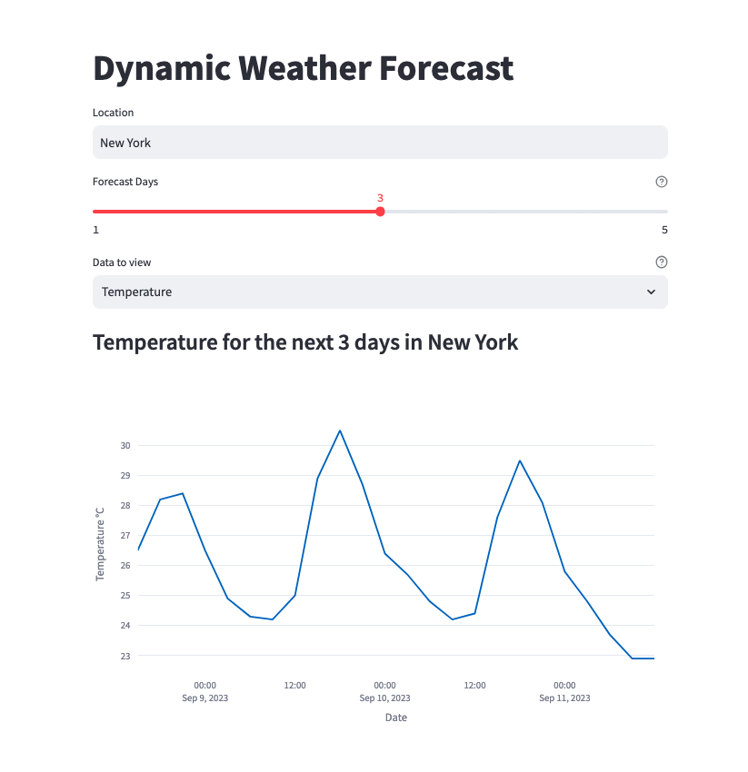

# Dynamic Weather Forecast App 🌦️
This app provides dynamic weather forecasting using the OpenWeatherMap API. Users can get a weather forecast for a location of their choice.

## Features
- Set the number of days for the forecast.
- View temperature in °C.
- View visibility and sky conditions with images.

## Installation
### Prerequisites
Ensure you have Python and pip installed.
Install the required libraries: `pip -r install requirements.txt`

### Setup
Clone the repository:
- git clone https://github.com/ChrisSamHarris/WeatherForecastApp.git
- cd WeatherForecastApp

### Set up the environment variable for the OpenWeatherMap API key:
`export WEATHER_API_KEY='your_openweathermap_api_key'`
Note: Replace **your_openweathermap_api_key** with your actual OpenWeatherMap API key.

## Run the app:
- `streamlit run home.py`
### Usage
1. Launch the app.
2. Enter the location you want to view the forecast for.
3. Select the number of days for the forecast using the slider.
4. Choose whether to view temperature or visibility and sky conditions.
5. The forecast will be displayed once you submit your location.

## Files
home.py: Contains the Streamlit user interface and main application logic. 
backend.py: Contains the function to retrieve data from OpenWeatherMap API. 
requirements.txt: Contains all required libraries and their dependencies.